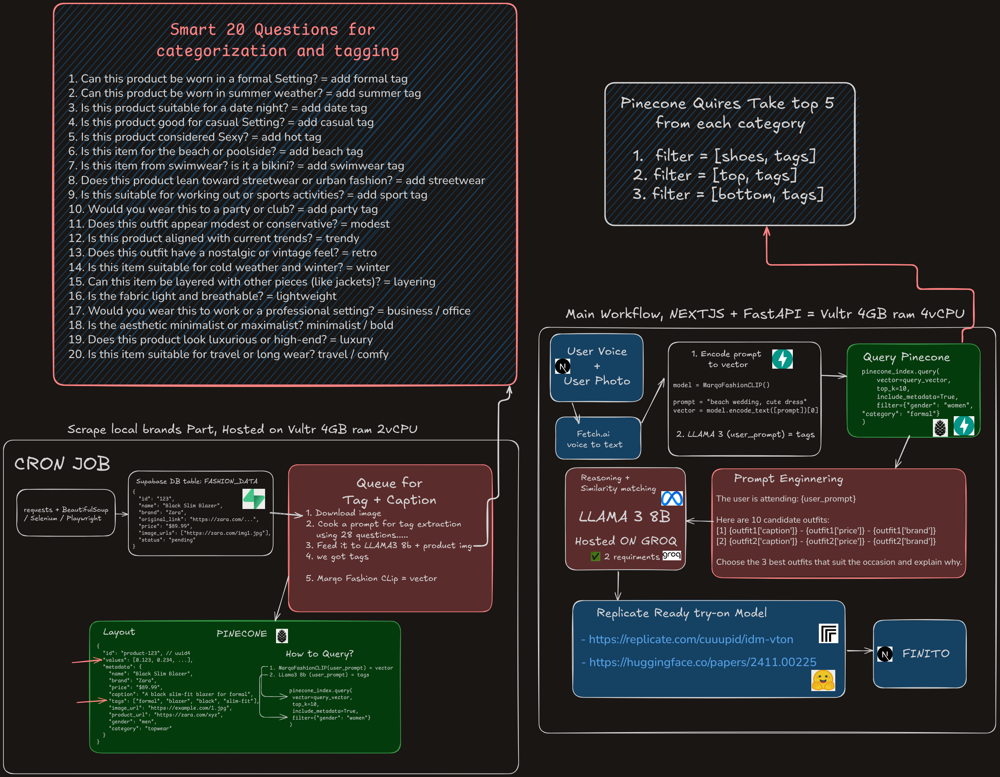

# Style Genie
Ai magic to turn your special events into fashioned memories

## Demo
- [youtu.be/Hg24F2vayWY](https://youtu.be/Hg24F2vayWY)
## Live
- [95.179.209.163/search](http://95.179.209.163/search)

## Workflow
  
  
  
[excalidraw.com](https://excalidraw.com/#json=p8WtNO5GwYW8236ERYRtP,V1oXMjJ2XGuJU6HnjeAh5g)

## Quick overview 
- Scrapping => Queue in Supabase => feed Groq LLama 4 model + custom prompt = tags  => MarqoFashionClipSigLIP = vector =====> Pinecone(Vector + tags)
- User voice => fetchAi agent => text prompt + user photo ==> feed Groq LLama3 (user_prompt + custom prompt) = tags, filters, prompt => MarqoFashionClipSigLIP(prompt) = vector =====> Pinecone(Vector + tags + filters) = top 5 fits ==> feed Groq LLama 3 (5 fits + prompt ask for matching) ====> display result
- Results => Replicate Try-On model => User final photo with final fit

## How to run Backend
- `cd backend`
- make sure you have python and run `pip3 install -r requirments.txt`
- use uvicorn to run fastapi ! `uvicorn main:app --host 0.0.0.0 --port 8000 --reload`
- Now run the frontend ! 

## How to run Frontend
- `cd frontend`
- make sure you have Nodejs locally and run `npm i` or if you have pnpm `pnpm i`
- then run `npn run dev` or if you have pnpm `pnpm dev`

## prompt testing (ai generated)

---

### 👗 Casual Everyday

1. `i need something chill to wear to brunch with friends`
2. `gotta go grocery shopping but still wanna look kinda cute lol`
3. `just some cozy clothes for running errands`
4. `help me find cool summer stuff not too hot but still stylish`
5. `need something comfy for walking my dog in the park`

---

### 🥂 Events / Occasions

6. `going to a wedding by the beach, need a dress that’s flowy and not too formal`
7. `i have a fancy dinner with my boss what do i wear??`
8. `friend's engagement party, kinda dressy but also outdoors`
9. `i’m a groomsman what kind of suit is best for a fall wedding`
10. `my cousin’s quinceañera is this weekend, any outfit ideas?`

---

### ❄️ Seasonal / Weather

11. `it’s freezing outside, give me warm layers please`
12. `going on a ski trip, need stylish but warm stuff`
13. `need rainy day gear that still looks good`
14. `hot af in dubai rn need light fits but no shorts`
15. `just started snowing and i have to commute to the office`

---

### 👟 Style-Driven

16. `i’m into y2k style rn gimme some inspo`
17. `anything with earth tones and kinda gender neutral`
18. `minimalist stuff pls, like black and clean lines`
19. `need something with retro vibes but modern cut`
20. `i want streetwear that doesn’t look tryhard`

---

### 🧍‍♂️ Gender/Body Hints

21. `i’m a short guy and want pants that don’t make me look weird`
22. `tall girl problems 😭 need jeans that actually fit`
23. `men’s winter outfits that aren’t all black`
24. `plus size formalwear for women pls`
25. `just something gender neutral and cozy`

# Authors
- Noor Amjad - [GitHub](https://github.com/Justxd22) / [Twitter](https://twitter.com/_xd222) / [LinkedIn](https://www.linkedin.com/in/noor-amjad-xd)
- Juliana -
- Nada - 
- Garret -

